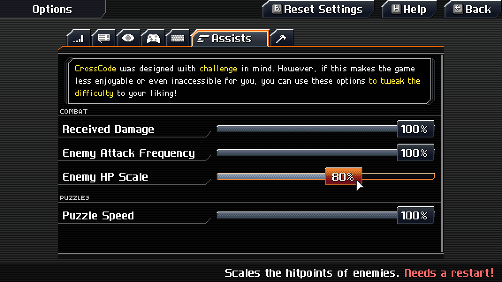

# Scale Enemy HP

This mod adds an assist option which scales the hitpoints of enemies. **Note that the game needs to
be restarted** after changing it!

This project is based on <https://github.com/falcorr/CCscaleHP>
(<https://gbatemp.net/threads/crosscode-mods.578327/>).

